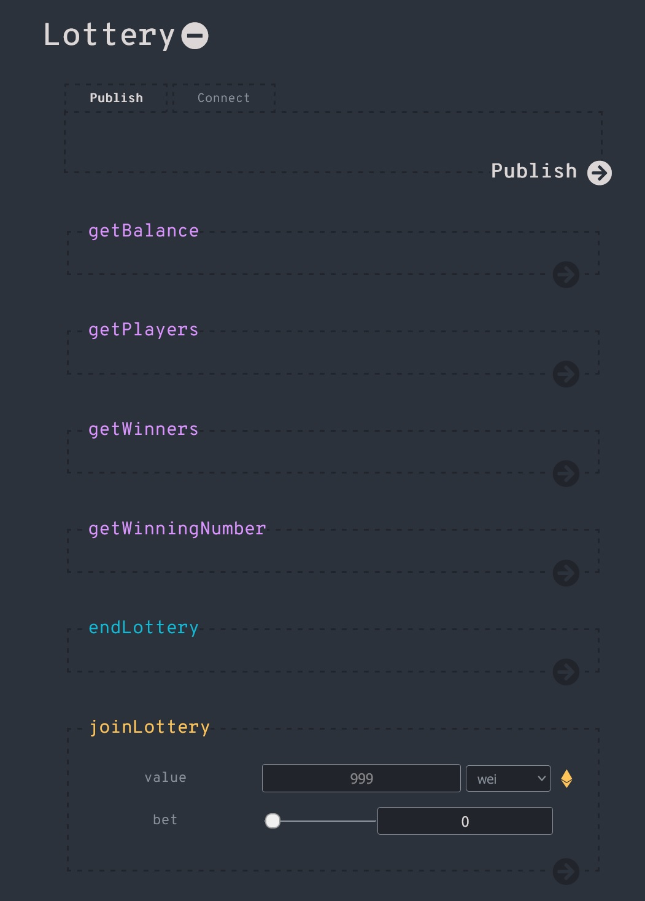
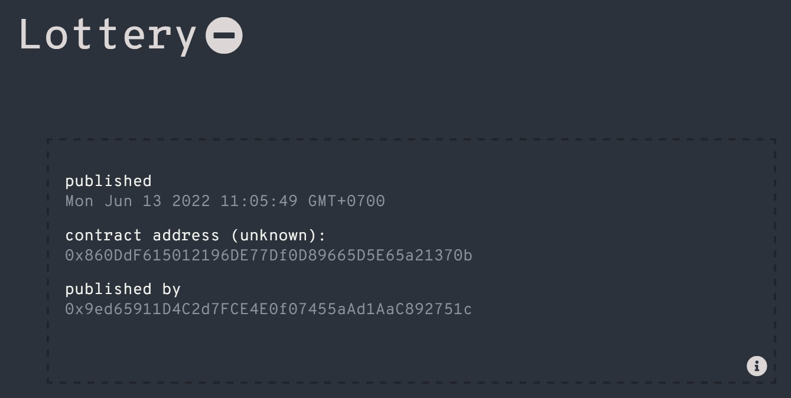

# Lottery dApp

This small dapp project shows how to build a lottery game smart contract with solidity and play with it via [smartcontract-ui](https://github.com/ninabreznik/smartcontract-UI) and MetaMask wallet.


## Quick Start

1. Install [MetaMask](https://metamask.io/download/) for your browser.
2. Connect MetaMask to a Ethereum testnet (e.g. Ropsten) or a local devnet (e.g. [Ganache](https://trufflesuite.com/ganache/))
3. Run the following commands to get started:
```
$ git clone https://github.com/tranminhkhoa/lottery-dapp.git
$ cd lottery-dapp
$ npm install
$ npm run build
$ npm start
```

(You can also deploy and interact with the lottery contact by copying the Solidity source code inside `./lottery-dapp/demo/Lottery.sol.js` and paste it to [Remix](https://remix.ethereum.org))

## Game Rules
- There are two actors in this lottery game: the **dealer** and the **player**.
- A dealer is the account deploying the lottery game contract. A player can be any other account.
- There is only one dealer and at most 100 players in an instance of the smart contract/game.
- The dealer can stop the game but cannot play the game.
- A player starts the game by depositing 1 eth to the smart contract address and betting a number from 0 to 99.
- No player can bet twice.
- When the dealer stops the game, the players who bet the number `x = block.timestamp % 100` will win the game. If there is no winner, the dealer takes 100% of deposited fund. If there is N winners, the dealer takes 10% of deposited fund, 90% left will be equally shared by N winners.
- No one can play if the game is closed.

## How to Play



1. A dealer Bob follows steps in Quick Start section above to open the browser app for the game, he presses `Publish` button in `Publish` tab and select an account in MetaMask wallet to deploy the game contract to some ethereum testnet.
2. After the contract has been successfully deployed, the contract information will be shown as below. The dealer can broadcast the `contract address` on websites/forums/chat groups so that everyone can join the lottery.



3. A player Alice starts the game by following steps described in Quick Start section above, she then switches to `Connect` tab and pastes the contract address in to the `contract_address` textbox and press `Connect` button.
4. Alice plays the game by calling `joinLottery` method to bet a number and deposit 1 eth to the contract.
5. Bob stops the lottery by calling `endLottery` method.
6. Everyone now can see the result by calling `getWinningNumber` method and who the winners are by calling `getWinners` method.

## To-Do List
- Add error handler to show error messages in the app.

## License

MIT
